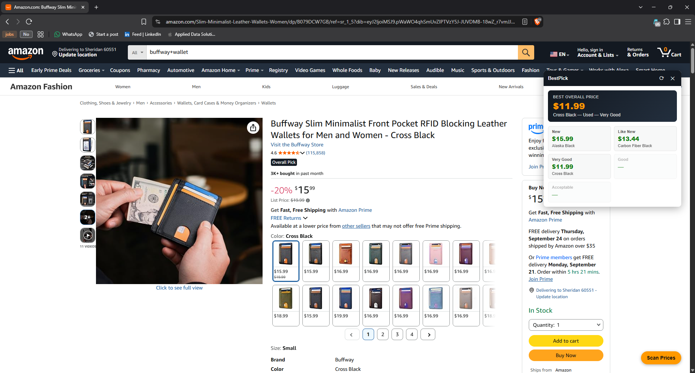
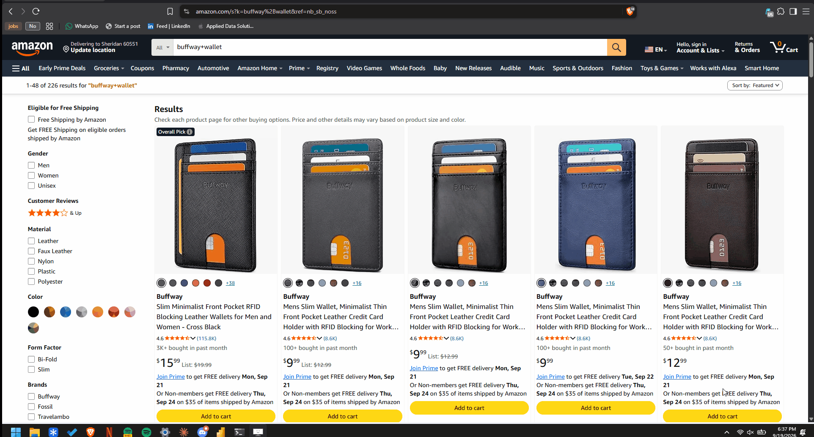
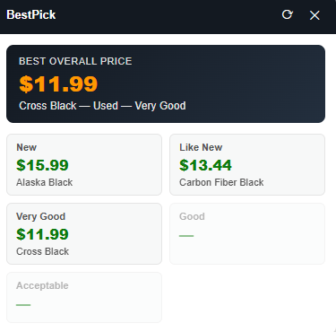
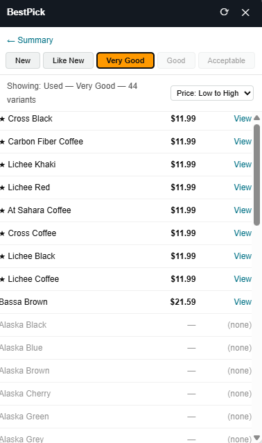
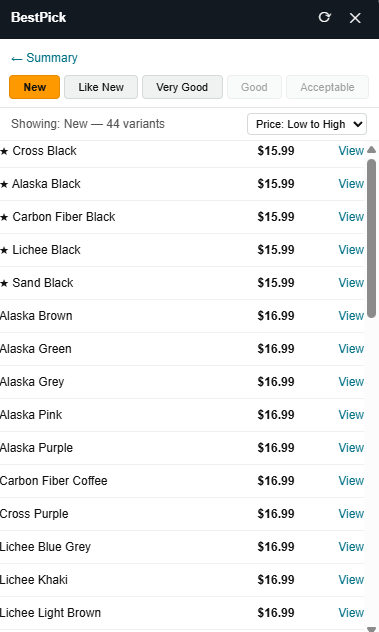

# BestPick

A Chrome extension that scans every variant on an Amazon product listing and finds the cheapest option across every condition — New, Like New, Very Good, Good, and Acceptable — in one pass.

**[Get it on the Chrome Web Store →](https://chromewebstore.google.com/detail/bestpick/pgfllnifhaeoglmpdafpmmodfalpckln)**

## What it does

Amazon product pages often have dozens of variants (color, size, style), each with its own set of third-party offers across different conditions. Checking all of them by hand means clicking into every variant one at a time. BestPick does that scan for you: click the button, and it fetches every variant's offer listing, parses out all five condition prices, and shows you the cheapest option overall — with the full breakdown one click away.

## Features

- **Summary view** — opens on the single best price found across every variant and condition, plus a best-price card per condition.
- **Detail view** — drill into any condition for a full sortable table (price or name, ascending or descending) of every variant.
- **One scan, all conditions** — each variant is fetched once; switching tabs or sort order never re-fetches.
- **Live progress** — results stream in as they're found, with a progress bar and a completion indicator.
- **Rate-limit aware** — backs off and shows a countdown if Amazon's bot-check kicks in, instead of silently reporting wrong data.

| Summary view | Detail view |
|---|---|
|  |  |

## Install

**Chrome Web Store (recommended):** [Install BestPick](https://chromewebstore.google.com/detail/bestpick/pgfllnifhaeoglmpdafpmmodfalpckln)

**From source (for development):**

1. Clone or download this repo.
2. Go to `chrome://extensions`, enable **Developer mode**.
3. Click **Load unpacked** and select the `bestpick/` folder.
4. Visit any Amazon product page with variants and click **Scan Prices**.

## Architecture

Manifest V3, no build step or bundler.

- **`background/`** — the service worker, loaded as an ES module (`manifest.json` sets `"type": "module"`), split by concern:
  - `config.js` — tunable constants (concurrency, delays, cooldown durations)
  - `parser.js` — HTML parsing: matches condition headings in the raw offer-listing markup and extracts the lowest price under each
  - `scanner.js` — orchestrates the concurrent fetch pool and block detection
  - `cooldown.js` — persists rate-limit backoff state via `chrome.storage.local`
  - `index.js` — entry point; wires the message listener
- **`content.js`** — detects variants on the page (`li[data-asin]` swatches) and injects the panel
- **`panel/`** — the UI, as content scripts sharing one `window.BestPick` namespace object (content scripts can't use ES module imports without a bundler, so this is the plain-JS equivalent): `state.js` (state + pure helpers), `render.js` (DOM rendering), `events.js` (event binding), `panel.js` (thin entry point)
- Background and content scripts talk over `chrome.runtime`/`chrome.tabs` messaging — one `RESULT` message per variant as it completes, then `DONE`

## Technical details

- **Concurrent fetching**: a pool of 5 workers pulls from a shared queue, each with a randomized 250-600ms delay between its own requests — measured to cut scan time roughly in half versus one-at-a-time fetching, while keeping sustained request volume modest.
- **Rate-limit backoff**: if Amazon's bot-check page shows up repeatedly in one scan, the scan aborts early and starts a cooldown (5 minutes, doubling up to a 1-hour cap on repeat offenses) rather than continuing to hit it or reporting a false "no offers found."
- **Resilient parsing**: prices are extracted by matching the condition heading text itself (e.g. "Used - Very Good") rather than relying on specific CSS class names, which Amazon's markup changes over time.
- **No account ties**: every fetch uses `credentials: 'omit'` — no cookies are sent, so scans aren't tied to your Amazon account or session, and can't influence your personalized recommendations.
- **No telemetry**: the only network calls anywhere in the extension are to `amazon.com` for the scan itself. Nothing is sent to any third party.

## Disclaimer

BestPick is an independent personal-use tool. It is not affiliated with, endorsed by, or sponsored by Amazon.com, Inc. or its affiliates. It reads publicly visible listing pages and does not bypass any login, paywall, or access control.

## Development note

Built with AI assistance — used to design, implement, debug, and iterate on the architecture and UI.

## License

MIT — see [LICENSE](LICENSE).
